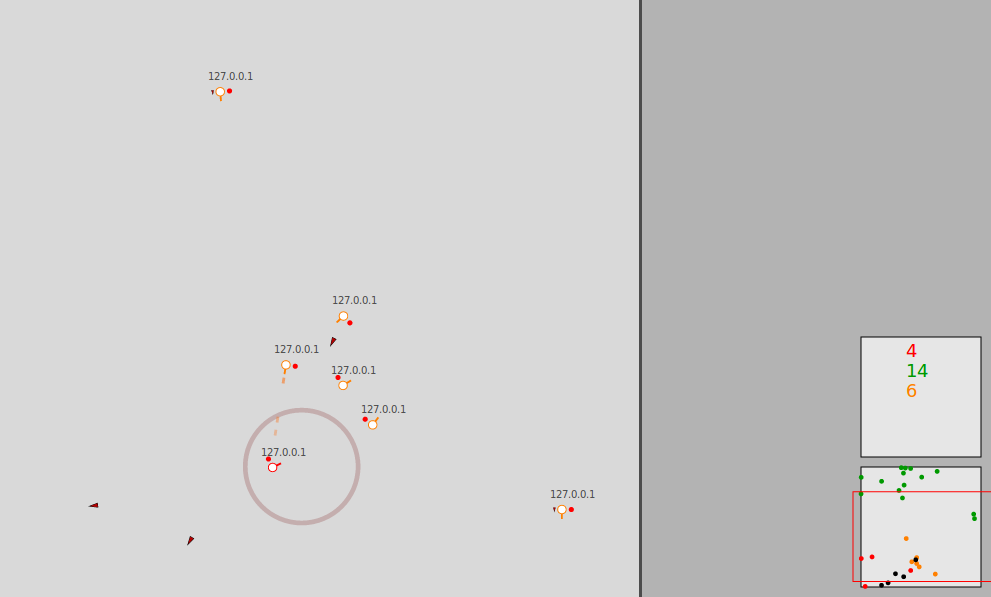

# robots

AI-controlled teams of robots battle it out on a 2D battlefield. 



## Overview

**robots** is a real-time 2D game where teams of robots compete to destroy each other.
Robots are controlled by AIs running over network connections.
Players compete by writing an AI to control robots.

## The robots

Each robot is identical and is fitted with two weapons:

* **laser**: this has unlimited ammunition, but has a limited range and will overheat if overused (requiring a cool-down period). Lasers do a small amount of damage.
* **missile**: this can be fired only once. It has unlimited range and will travel indefinitely until it hits a robot. A missile hit will destroy a robot.

Robots act independently, but may communicate to nearby robots through a system of coloured signals.

## Usage

Start a game world server:
```shell
./main.py
```

Start a single robot running AI/ExampleAI, joining team 3, on a server running at localhost port 12345:
```shell
./Client.py --ai=ExampleAI --team=3 --server=localhost:12345
```

Once robots successfully connect to the game world they immediately start to act autonomously according to their AI.

## Writing an AI

TODO

## Known issues

* Very messy graphics code.
* Game world server/port currently cannot be specified.
* Laser cooldown is wrong.

